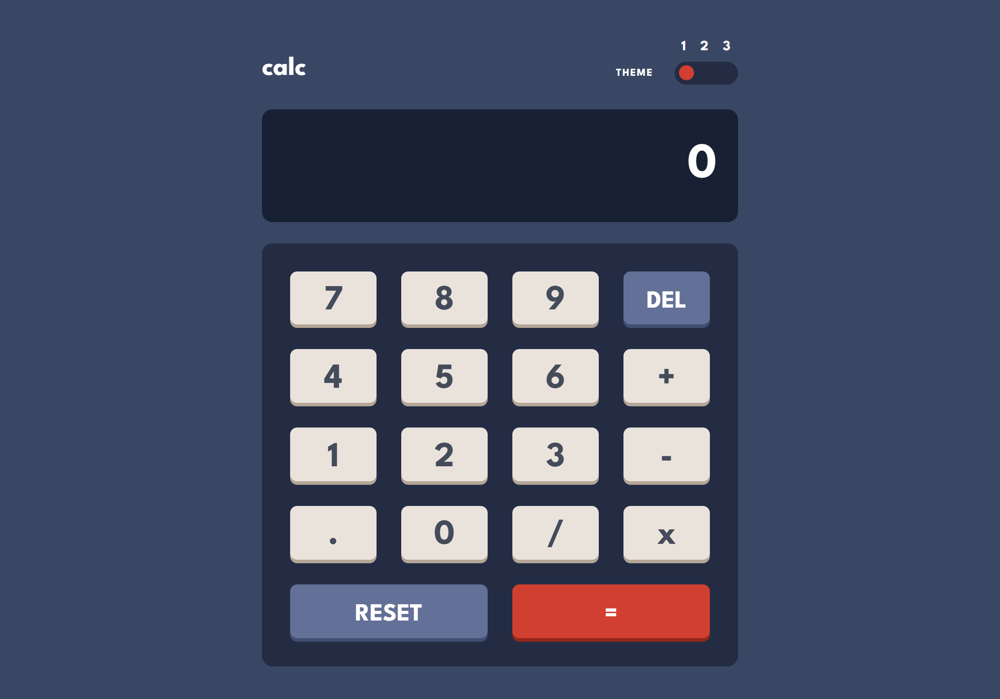

# Frontend Mentor - Calculator app solution

This is a solution to the [Calculator app challenge on Frontend Mentor](https://www.frontendmentor.io/challenges/calculator-app-9lteq5N29). Frontend Mentor challenges help you improve your coding skills by building realistic projects. 

## Table of contents

- [Overview](#overview)
  - [The challenge](#the-challenge)
  - [Screenshot](#screenshot)
  - [Links](#links)
- [My process](#my-process)
  - [Built with](#built-with)
  - [What I learned](#what-i-learned)
- [Author](#author)

## Overview

### The challenge

Users should be able to:

- See the size of the elements adjust based on their device's screen size
- Perform mathmatical operations like addition, subtraction, multiplication, and division
- Adjust the color theme based on their preference
- **Bonus**: Have their initial theme preference checked using `prefers-color-scheme` and have any additional changes saved in the browser

### Screenshot

### Links

- Solution URL: https://www.frontendmentor.io/solutions/calculator-pwa-app-using-gatsbyjs-reactjs-and-tailwind-OF-EFBiJnZ
- Live Site URL: https://zingy-basbousa-fabe8d.netlify.app/

## My process

### Built with

- Semantic HTML5 markup
- CSS custom properties
- Flexbox
- CSS Grid
- Mobile-first workflow
- [React](https://reactjs.org/) - JS library
- [Gatsby.js](https://www.gatsbyjs.com/) - React framework
- [Tailwind CSS](https://tailwindcss.com/) - For styles

### What I learned

For this exercise I used the React framework GatsbyJS with TailwindCSS.
I used the Grid disposition for the keyboard of the calculator.
The app uses the React hooks useEffect and useState.
When open the app, this checks your color scheme (dark or light) of your browser and applies the corresponding style.
(* In Google Chrome this feature doesn't work and shows always light theme).
And on changing the color theme it saves in the local storage.

## Author

- Frontend Mentor - [@ivansgarcia](https://www.frontendmentor.io/profile/ivansgarcia)