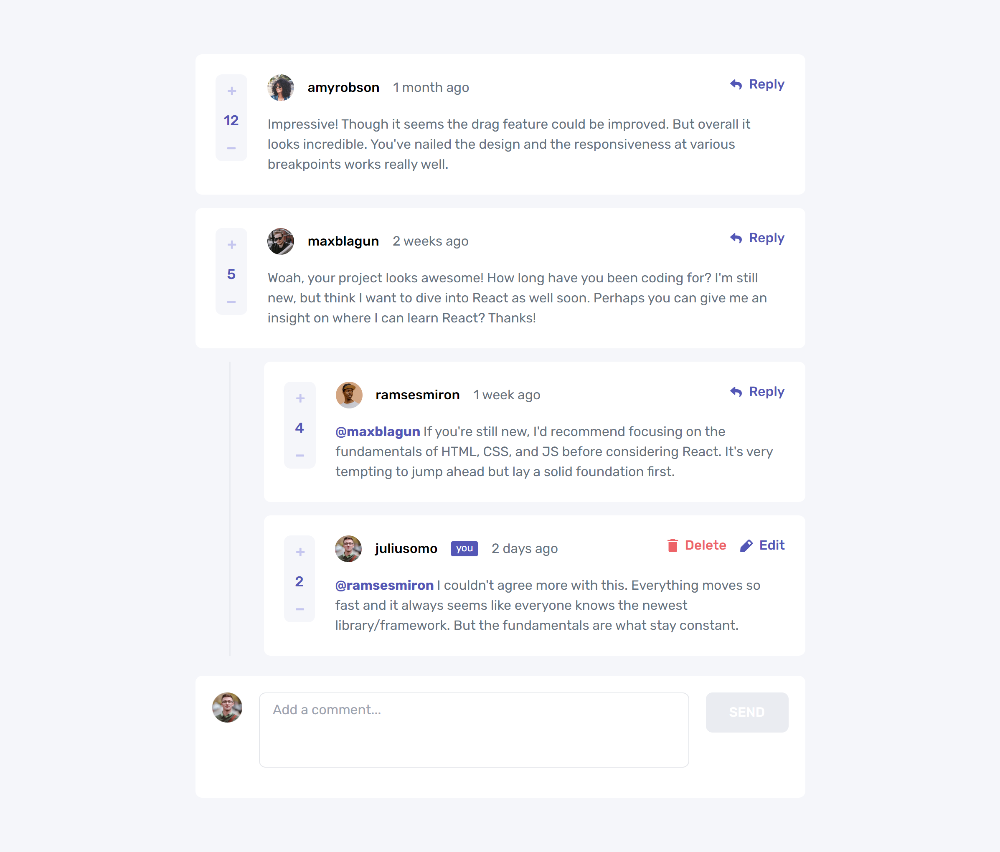

# Frontend Mentor - Interactive comments section solution

This is a solution to the [Interactive comments section challenge on Frontend Mentor](https://www.frontendmentor.io/challenges/interactive-comments-section-iG1RugEG9). Frontend Mentor challenges help you improve your coding skills by building realistic projects. 

## Table of contents

- [Overview](#overview)
  - [The challenge](#the-challenge)
  - [Screenshot](#screenshot)
  - [Links](#links)
- [My process](#my-process)
  - [Built with](#built-with)
  - [What I learned](#what-i-learned)
- [Author](#author)

## Overview

### The challenge

Users should be able to:

- View the optimal layout for the app depending on their device's screen size
- See hover states for all interactive elements on the page
- Create, Read, Update, and Delete comments and replies
- Upvote and downvote comments
- **Bonus**: If you're building a purely front-end project, use `localStorage` to save the current state in the browser that persists when the browser is refreshed.
- **Bonus**: Instead of using the `createdAt` strings from the `data.json` file, try using timestamps and dynamically track the time since the comment or reply was posted.

### Screenshot

### Links

- Solution URL: https://www.frontendmentor.io/solutions/interactive-comments-sections-created-with-gatsbyjs-and-tailwindcss-Nf5apOWfwr
- Live Site URL: https://gentle-fairy-950fe7.netlify.app/

## My process

### Built with

- Semantic HTML5 markup
- CSS custom properties
- Flexbox
- Mobile-first workflow
- [React](https://reactjs.org/) - JS library
- [Gatsby.js](https://www.gatsbyjs.com/) - React framework
- [TailwindCSS](https://tailwindcss.com/) - For styles

### What I learned

In this exercise I used the React framework GatsbyJS for create the webpage with TailwindCSS for apply styles to it.

I created it with the Mobile-first workflow.

You can create new comments, edit and delete them. Also you can upvote a comment and undo this.
The app saves the new comments date and shows the passed time since it was posted.

## Author

- Frontend Mentor - [@ivansgarcia](https://www.frontendmentor.io/profile/ivansgarcia)