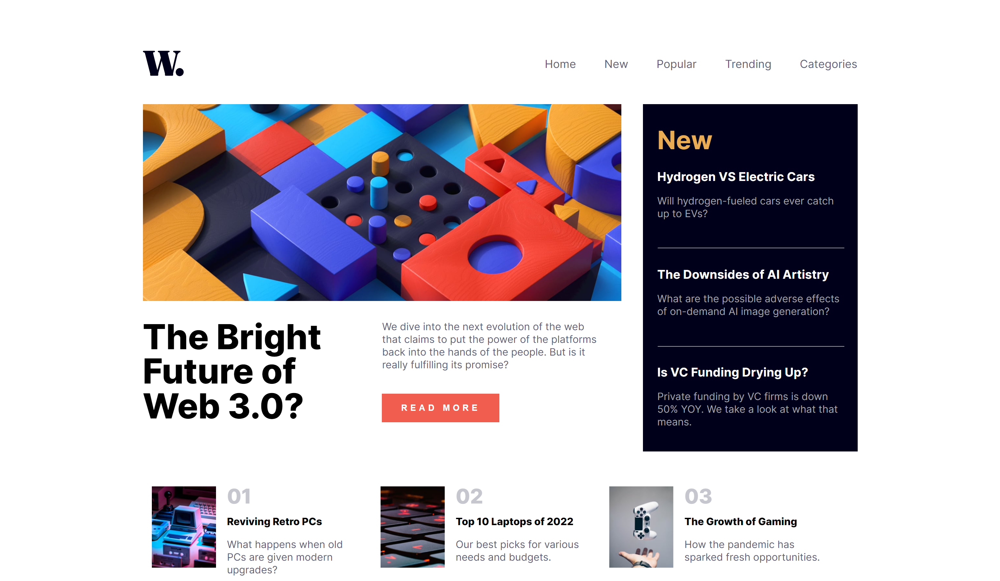

# Frontend Mentor - News homepage solution

This is a solution to the [News homepage challenge on Frontend Mentor](https://www.frontendmentor.io/challenges/news-homepage-H6SWTa1MFl). Frontend Mentor challenges help you improve your coding skills by building realistic projects. 

## Table of contents

- [Overview](#overview)
  - [The challenge](#the-challenge)
  - [Screenshot](#screenshot)
  - [Links](#links)
- [My process](#my-process)
  - [Built with](#built-with)
  - [What I learned](#what-i-learned)
  - [Continued development](#continued-development)
  - [Useful resources](#useful-resources)
- [Author](#author)
- [Acknowledgments](#acknowledgments)

## Overview

### The challenge

Users should be able to:

- View the optimal layout for the interface depending on their device's screen size
- See hover and focus states for all interactive elements on the page

### Screenshot

### Links

- Solution URL: https://www.frontendmentor.io/solutions/news-homepage-using-sass-for-responsive-desing-FYjyuVNwsg
- Live Site URL: https://ornate-paprenjak-891eca.netlify.app

## My process

### Built with

- Semantic HTML5 markup
- CSS custom properties
- Flexbox
- Mobile-first workflow
- [Sass](https://sass-lang.com/) - Style processor

### What I learned

This exercise is designed using Responsive Design.
I practice using pseudoclasses and media-queries.
The JS file manages the menu behaviour for mobile devices.

## Author

- Frontend Mentor - [@ivansgarcia](https://www.frontendmentor.io/profile/ivansgarcia)
