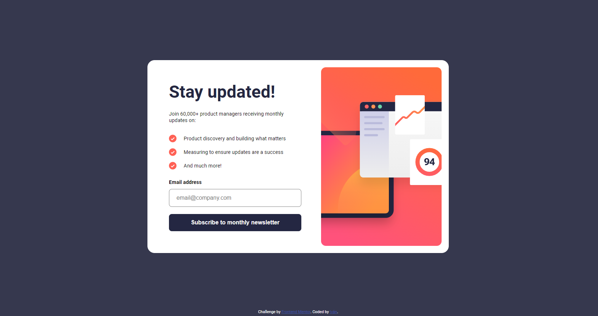

# Frontend Mentor - Newsletter sign-up form with success message solution

This is a solution to the [Newsletter sign-up form with success message challenge on Frontend Mentor](https://www.frontendmentor.io/challenges/newsletter-signup-form-with-success-message-3FC1AZbNrv). Frontend Mentor challenges help you improve your coding skills by building realistic projects. 

## Table of contents

- [Overview](#overview)
  - [The challenge](#the-challenge)
  - [Screenshot](#screenshot)
  - [Links](#links)
- [My process](#my-process)
  - [Built with](#built-with)
  - [What I learned](#what-i-learned)
  - [Continued development](#continued-development)
  - [Useful resources](#useful-resources)
- [Author](#author)
- [Acknowledgments](#acknowledgments)

## Overview

### The challenge

Users should be able to:

- Add their email and submit the form
- See a success message with their email after successfully submitting the form
- See form validation messages if:
  - The field is left empty
  - The email address is not formatted correctly
- View the optimal layout for the interface depending on their device's screen size
- See hover and focus states for all interactive elements on the page

### Screenshot

### Links

- Solution URL: https://www.frontendmentor.io/solutions/newsletter-sign-up-form-with-success-message-VtVZvFyNU6
- Live Site URL: https://delicate-clafoutis-cd952b.netlify.app/

## My process

### Built with

- Semantic HTML5 markup
- CSS custom properties
- Flexbox

### What I learned

In this exercise I learned to manage the modiffication of the html elements using Javascript.
The use of JS to manage the input data to show error messages and the use of media-queries to adapt the page to different screen sizes.

### Continued development

In next projects will be better to use some style processors.

### Useful resources

## Author

- Website - [Iván Salinas]
- Frontend Mentor - [@ivansgarcia](https://www.frontendmentor.io/profile/ivansgarcia)