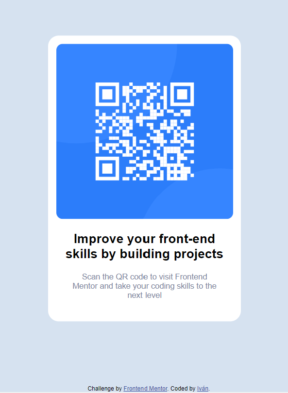

# Frontend Mentor - QR code component solution

This is a solution to the [QR code component challenge on Frontend Mentor](https://www.frontendmentor.io/challenges/qr-code-component-iux_sIO_H). Frontend Mentor challenges help you improve your coding skills by building realistic projects. 

## Table of contents

- [Overview](#overview)
  - [Screenshot](#screenshot)
  - [Links](#links)
- [My process](#my-process)
  - [Built with](#built-with)
  - [What I learned](#what-i-learned)
  - [Continued development](#continued-development)
  - [Useful resources](#useful-resources)
- [Author](#author)
- [Acknowledgments](#acknowledgments)

## Overview

This is an exercise of design of a HTML.
The HTML shows a QR code with a text explain following the instructions given and the designs provided.

### Screenshot



### Links

- Solution URL: https://www.frontendmentor.io/solutions/qr-code-component-M9BhZKQOkJ
- Live Site URL: https://polite-sprinkles-d69133.netlify.app/


## My process

### Built with

- Semantic HTML5 markup
- CSS custom properties

### What I learned

The use of relative sizes to adapt the web to different screen sizes.
```css
  .container {
    max-width: 330px;
    width: 80%;
  }
```
To center elements using position and transform attributes.
```css
  .container {
    position: absolute;
    top: 50%;
    left: 50%;
    transform: translate(-50%, -50%);
  }
```
To import fonts from Google Fonts.
```css
  @import url('https://fonts.googleapis.com/css2?family=Outfit:wght@400;700&family=Ubuntu:wght 290;400;500;700&display=swap');

```

### Continued development

In future exercises I will use css processors for style the html.

## Author

- Website - [Iván Salinas]
- Frontend Mentor - [@yourusername](https://www.frontendmentor.io/profile/ivansgarcia)
