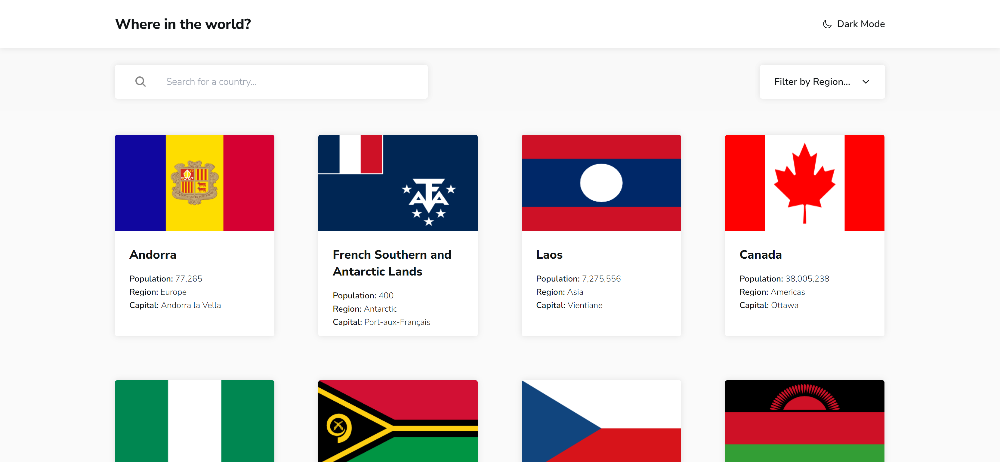

# Frontend Mentor - REST Countries API with color theme switcher solution

This is a solution to the [REST Countries API with color theme switcher challenge on Frontend Mentor](https://www.frontendmentor.io/challenges/rest-countries-api-with-color-theme-switcher-5cacc469fec04111f7b848ca). Frontend Mentor challenges help you improve your coding skills by building realistic projects. 

## Table of contents

- [Overview](#overview)
  - [The challenge](#the-challenge)
  - [Screenshot](#screenshot)
  - [Links](#links)
- [My process](#my-process)
  - [Built with](#built-with)
  - [What I learned](#what-i-learned)
- [Author](#author)

## Overview

### The challenge

Users should be able to:

- See all countries from the API on the homepage
- Search for a country using an `input` field
- Filter countries by region
- Click on a country to see more detailed information on a separate page
- Click through to the border countries on the detail page
- Toggle the color scheme between light and dark mode *(optional)*

### Screenshot

### Links

- Solution URL: https://www.frontendmentor.io/solutions/rest-country-api-with-react-gatsby-and-tailwind-75vuTpWQJl
- Live Site URL: https://country-rest-api-exercise.netlify.app/
## My process

### Built with

- Semantic HTML5 markup
- CSS custom properties
- Flexbox
- CSS Grid
- Mobile-first workflow
- [React](https://reactjs.org/) - JS library
- [Gatsby.js](https://www.gatsbyjs.com/) - React framework
- [Styled Components](https://tailwindcss.com/) - For styles

### What I learned

I created this site using the React framework GatsbyJS and Tailwind.

I added some effects to reorganize elements on scrolling.

You can select dark or light mode and this configuration saves on the localhost.

It connects to the Countries API using axios.

## Author

- Frontend Mentor - [@ivansgarcia](https://www.frontendmentor.io/profile/ivansgarcia)