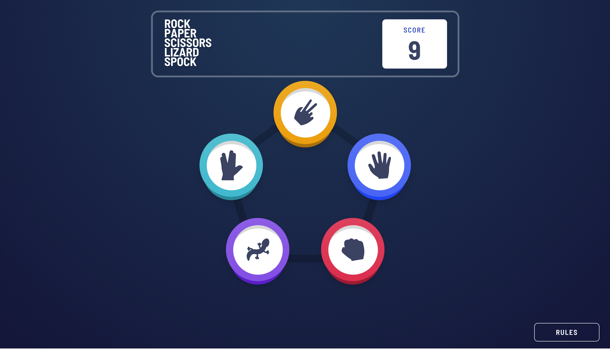

# Frontend Mentor - Rock, Paper, Scissors solution

This is a solution to the [Rock, Paper, Scissors challenge on Frontend Mentor](https://www.frontendmentor.io/challenges/rock-paper-scissors-game-pTgwgvgH). Frontend Mentor challenges help you improve your coding skills by building realistic projects. 

## Table of contents

- [Overview](#overview)
  - [The challenge](#the-challenge)
  - [Screenshot](#screenshot)
  - [Links](#links)
- [My process](#my-process)
  - [Built with](#built-with)
  - [What I learned](#what-i-learned)
- [Author](#author)

## Overview

### The challenge

Users should be able to:

- View the optimal layout for the game depending on their device's screen size
- Play Rock, Paper, Scissors against the computer
- Maintain the state of the score after refreshing the browser _(optional)_
- **Bonus**: Play Rock, Paper, Scissors, Lizard, Spock against the computer _(optional)_

### Screenshot

### Links

- Solution URL: https://www.frontendmentor.io/solutions/rock-paper-scissors-game-pwa-using-gatsbyjs-react-an-tailwind-css-2OA_d6S6Kb
- Live Site URL: https://stirring-frangipane-e740a9.netlify.app/

## My process

### Built with

- Semantic HTML5 markup
- CSS custom properties
- Flexbox
- CSS Grid
- Mobile-first workflow
- [React](https://reactjs.org/) - JS library
- [Gatsby.js](https://www.gatsbyjs.com/) - React framework
- [Tailwind CSS](https://tailwindcss.com/) - For styles

### What I learned

Scaled to Rock, Paper, Scissors, Lizard, Spock game.
I created this game using the React framework GatsbyJS and using TailwindCSS for its styles.
The app uses some custom animations for the buttons.
It saves the score in the localhost.
Its a PWA.

## Author

- Frontend Mentor - [@ivansgarcia](https://www.frontendmentor.io/profile/ivansgarcia)